流媒体权限融合管理系统功能模块结构

1. 系统管理模块
   1.1 用户管理
   1.2 角色管理
   1.3 菜单管理
   1.4 部门管理
   1.5 岗位管理
   1.6 字典管理
   1.6.1 字典类型管理
   1.6.2 字典数据管理
   1.7 参数设置
   1.8 通知公告
   1.9 工作台
2. 系统监控模块
   2.1 操作日志
   2.2 登录日志
   2.3 在线用户
   2.4 服务器监控
   2.5 缓存监控
3. 流媒体设备管理模块
   3.1 GB28181设备管理
   3.1.1 设备查询
   3.1.2 设备配置
   3.1.3 设备控制
   3.2 ONVIF设备管理
   3.2.1 ONVIF设备发现
   3.2.2 ONVIF设备配置
   3.2.3 ONVIF服务管理
   3.3 RTSP设备管理
   3.3.1 RTSP设备添加
   3.3.2 RTSP设备测试
4. 视频流管理模块
   4.1 实时预览
   4.2 录像回放
   4.3 流代理管理
   4.4 推流管理
   4.5 RTP流管理
5. 平台级联模块
   5.1 平台管理
   5.2 通道管理
   5.2.1 公共通道管理
   5.2.2 平台通道管理
   5.3 分组管理
   5.3.1 行政分组
   5.3.2 区域管理
6. 录像管理模块
   6.1 GB28181录像
   6.1.1 录像查询
   6.1.2 录像下载
   6.2 云端录像
   6.3 录像计划
   6.3.1 录像计划配置
   6.3.2 录像计划关联通道
7. 告警管理模块
   7.1 设备告警
   7.1.1 告警查询
   7.1.2 告警处理
   7.2 告警统计
8. 云台控制模块
   8.1 PTZ控制
   8.1.1 方向控制
   8.1.2 变倍控制
   8.1.3 聚焦控制
   8.2 预置位管理
   8.2.1 预置位设置
   8.2.2 预置位调用
   8.3 巡航管理
   8.4 扫描管理
   8.5 辅助功能控制
   8.5.1 雨刷控制
   8.5.2 灯光控制
9. 媒体服务模块
   9.1 媒体服务器管理
   9.1.1 服务器配置
   9.1.2 服务器监控
   9.2 流媒体服务配置
10. 辅助功能模块
    10.1 移动定位
    10.2 收藏管理
    10.2.1 收藏夹管理
    10.2.2 收藏通道管理
    10.3 标记管理
    10.3.1 标记管理
    10.3.2 标记通道管理
    10.4 用户API密钥
    10.5 日志管理
    10.6 服务器推送事件(SSE)
11. 通用功能模块
    11.1 验证码
    11.2 通用接口
    11.3 地图服务
    11.4 大屏展示

```mermaid
%%{init: {'flowchart': {'nodeSpacing': 20, 'rankSpacing': 40, 'curve': 'basis'}}}%%
flowchart TD

    A[系统功能模块图]

    A --> B["系<br/>统<br/>管<br/>理<br/>模<br/>块"]
    A --> C["系<br/>统<br/>监<br/>控<br/>模<br/>块"]
    A --> D["流<br/>媒<br/>体<br/>设<br/>备<br/>管<br/>理<br/>模<br/>块"]
    A --> E["视<br/>频<br/>流<br/>管<br/>理<br/>模<br/>块"]
    A --> F["平<br/>台<br/>级<br/>联<br/>模<br/>块"]
    A --> G["录<br/>像<br/>管<br/>理<br/>模<br/>块"]
    A --> H["告<br/>警<br/>管<br/>理<br/>模<br/>块"]
    A --> I["云<br/>台<br/>控<br/>制<br/>模<br/>块"]
    A --> J["媒<br/>体<br/>服<br/>务<br/>模<br/>块"]
    A --> K["辅<br/>助<br/>功<br/>能<br/>模<br/>块"]
    A --> L["通<br/>用<br/>功<br/>能<br/>模<br/>块"]

    B --> B1["用<br/>户<br/>管<br/>理"]
    B --> B2["角<br/>色<br/>管<br/>理"]
    B --> B3["菜<br/>单<br/>管<br/>理"]
    B --> B4["部<br/>门<br/>管<br/>理"]
    B --> B5["岗<br/>位<br/>管<br/>理"]
    B --> B6["字<br/>典<br/>管<br/>理"]
    B --> B7["参<br/>数<br/>设<br/>置"]
    B --> B8["通<br/>知<br/>公<br/>告"]
    B --> B9["工<br/>作<br/>台"]

    B6 --> B61["字<br/>典<br/>类<br/>型<br/>管<br/>理"]
    B6 --> B62["字<br/>典<br/>数<br/>据<br/>管<br/>理"]

    C --> C1["操<br/>作<br/>日<br/>志"]
    C --> C2["登<br/>录<br/>日<br/>志"]
    C --> C3["在<br/>线<br/>用<br/>户"]
    C --> C4["服<br/>务<br/>器<br/>监<br/>控"]
    C --> C5["缓<br/>存<br/>监<br/>控"]

    D --> D1["G<br/>B<br/>2<br/>8<br/>1<br/>8<br/>1<br/>设<br/>备<br/>管<br/>理"]
    D --> D2["O<br/>N<br/>V<br/>I<br/>F<br/>设<br/>备<br/>管<br/>理"]
    D --> D3["R<br/>T<br/>S<br/>P<br/>设<br/>备<br/>管<br/>理"]

    D1 --> D11["设<br/>备<br/>查<br/>询"]
    D1 --> D12["设<br/>备<br/>配<br/>置"]
    D1 --> D13["设<br/>备<br/>控<br/>制"]

    D2 --> D21["O<br/>N<br/>V<br/>I<br/>F<br/>设<br/>备<br/>发<br/>现"]
    D2 --> D22["O<br/>N<br/>V<br/>I<br/>F<br/>设<br/>备<br/>配<br/>置"]
    D2 --> D23["O<br/>N<br/>V<br/>I<br/>F<br/>服<br/>务<br/>管<br/>理"]

    D3 --> D31["R<br/>T<br/>S<br/>P<br/>设<br/>备<br/>添<br/>加"]
    D3 --> D32["R<br/>T<br/>S<br/>P<br/>设<br/>备<br/>测<br/>试"]

    E --> E1["实<br/>时<br/>预<br/>览"]
    E --> E2["录<br/>像<br/>回<br/>放"]
    E --> E3["流<br/>代<br/>理<br/>管<br/>理"]
    E --> E4["推<br/>流<br/>管<br/>理"]
    E --> E5["R<br/>T<br/>P<br/>流<br/>管<br/>理"]

    F --> F1["平<br/>台<br/>管<br/>理"]
    F --> F2["通<br/>道<br/>管<br/>理"]
    F --> F3["分<br/>组<br/>管<br/>理"]

    F2 --> F21["公<br/>共<br/>通<br/>道<br/>管<br/>理"]
    F2 --> F22["平<br/>台<br/>通<br/>道<br/>管<br/>理"]

    F3 --> F31["行<br/>政<br/>分<br/>组"]
    F3 --> F32["区<br/>域<br/>管<br/>理"]

    G --> G1["G<br/>B<br/>2<br/>8<br/>1<br/>8<br/>1<br/>录<br/>像"]
    G --> G2["云<br/>端<br/>录<br/>像"]
    G --> G3["录<br/>像<br/>计<br/>划"]

    G1 --> G11["录<br/>像<br/>查<br/>询"]
    G1 --> G12["录<br/>像<br/>下<br/>载"]

    G3 --> G31["录<br/>像<br/>计<br/>划<br/>配<br/>置"]
    G3 --> G32["录<br/>像<br/>计<br/>划<br/>关<br/>联<br/>通<br/>道"]

    H --> H1["设<br/>备<br/>告<br/>警"]
    H --> H2["告<br/>警<br/>统<br/>计"]

    H1 --> H11["告<br/>警<br/>查<br/>询"]
    H1 --> H12["告<br/>警<br/>处<br/>理"]

    I --> I1["P<br/>T<br/>Z<br/>控<br/>制"]
    I --> I2["预<br/>置<br/>位<br/>管<br/>理"]
    I --> I3["巡<br/>航<br/>管<br/>理"]
    I --> I4["扫<br/>描<br/>管<br/>理"]
    I --> I5["辅<br/>助<br/>功<br/>能<br/>控<br/>制"]

    I1 --> I11["方<br/>向<br/>控<br/>制"]
    I1 --> I12["变<br/>倍<br/>控<br/>制"]
    I1 --> I13["聚<br/>焦<br/>控<br/>制"]

    I2 --> I21["预<br/>置<br/>位<br/>设<br/>置"]
    I2 --> I22["预<br/>置<br/>位<br/>调<br/>用"]

    I5 --> I51["雨<br/>刷<br/>控<br/>制"]
    I5 --> I52["灯<br/>光<br/>控<br/>制"]

    J --> J1["媒<br/>体<br/>服<br/>务<br/>器<br/>管<br/>理"]
    J --> J2["流<br/>媒<br/>体<br/>服<br/>务<br/>配<br/>置"]

    J1 --> J11["服<br/>务<br/>器<br/>配<br/>置"]
    J1 --> J12["服<br/>务<br/>器<br/>监<br/>控"]

    K --> K1["移<br/>动<br/>定<br/>位"]
    K --> K2["收<br/>藏<br/>管<br/>理"]
    K --> K3["标<br/>记<br/>管<br/>理"]
    K --> K4["用<br/>户<br/>A<br/>P<br/>I<br/>密<br/>钥"]
    K --> K5["日<br/>志<br/>管<br/>理"]
    K --> K6["服<br/>务<br/>器<br/>推<br/>送<br/>事<br/>件<br/>(<br/>S<br/>S<br/>E<br/>)"]

    K2 --> K21["收<br/>藏<br/>夹<br/>管<br/>理"]
    K2 --> K22["收<br/>藏<br/>通<br/>道<br/>管<br/>理"]

    K3 --> K31["标<br/>记<br/>管<br/>理"]
    K3 --> K32["标<br/>记<br/>通<br/>道<br/>管<br/>理"]

    L --> L1["验<br/>证<br/>码"]
    L --> L2["通<br/>用<br/>接<br/>口"]
    L --> L3["地<br/>图<br/>服<br/>务"]
    L --> L4["大<br/>屏<br/>展<br/>示"]
```

适用于 Excalidraw 的 Mermaid 代码：

```mermaid
%%{init: {'flowchart': {'nodeSpacing': 30, 'rankSpacing': 50, 'curve': 'basis'}}}%%
flowchart TD

    A[系统功能模块图]

    A --> B[系统管理模块]
    A --> C[系统监控模块]
    A --> D[流媒体设备管理模块]
    A --> E[视频流管理模块]
    A --> F[平台级联模块]
    A --> G[录像管理模块]
    A --> H[告警管理模块]
    A --> I[云台控制模块]
    A --> J[媒体服务模块]
    A --> K[辅助功能模块]
    A --> L[通用功能模块]

    B --> B1[用户管理]
    B --> B2[角色管理]
    B --> B3[菜单管理]
    B --> B4[部门管理]
    B --> B5[岗位管理]
    B --> B6[字典管理]
    B --> B7[参数设置]
    B --> B8[通知公告]
    B --> B9[工作台]

    B6 --> B61[字典类型管理]
    B6 --> B62[字典数据管理]

    C --> C1[操作日志]
    C --> C2[登录日志]
    C --> C3[在线用户]
    C --> C4[服务器监控]
    C --> C5[缓存监控]

    D --> D1[GB28181设备管理]
    D --> D2[ONVIF设备管理]
    D --> D3[RTSP设备管理]

    D1 --> D11[设备查询]
    D1 --> D12[设备配置]
    D1 --> D13[设备控制]

    D2 --> D21[ONVIF设备发现]
    D2 --> D22[ONVIF设备配置]
    D2 --> D23[ONVIF服务管理]

    D3 --> D31[RTSP设备添加]
    D3 --> D32[RTSP设备测试]

    E --> E1[实时预览]
    E --> E2[录像回放]
    E --> E3[流代理管理]
    E --> E4[推流管理]
    E --> E5[RTP流管理]

    F --> F1[平台管理]
    F --> F2[通道管理]
    F --> F3[分组管理]

    F2 --> F21[公共通道管理]
    F2 --> F22[平台通道管理]

    F3 --> F31[行政分组]
    F3 --> F32[区域管理]

    G --> G1[GB28181录像]
    G --> G2[云端录像]
    G --> G3[录像计划]

    G1 --> G11[录像查询]
    G1 --> G12[录像下载]

    G3 --> G31[录像计划配置]
    G3 --> G32[录像计划关联通道]

    H --> H1[设备告警]
    H --> H2[告警统计]

    H1 --> H11[告警查询]
    H1 --> H12[告警处理]

    I --> I1[PTZ控制]
    I --> I2[预置位管理]
    I --> I3[巡航管理]
    I --> I4[扫描管理]
    I --> I5[辅助功能控制]

    I1 --> I11[方向控制]
    I1 --> I12[变倍控制]
    I1 --> I13[聚焦控制]

    I2 --> I21[预置位设置]
    I2 --> I22[预置位调用]

    I5 --> I51[雨刷控制]
    I5 --> I52[灯光控制]

    J --> J1[媒体服务器管理]
    J --> J2[流媒体服务配置]

    J1 --> J11[服务器配置]
    J1 --> J12[服务器监控]

    K --> K1[移动定位]
    K --> K2[收藏管理]
    K --> K3[标记管理]
    K --> K4[用户API密钥]
    K --> K5[日志管理]
    K --> K6["服务器推送事件(SSE)"]

    K2 --> K21[收藏夹管理]
    K2 --> K22[收藏通道管理]

    K3 --> K31[标记管理]
    K3 --> K32[标记通道管理]

    L --> L1[验证码]
    L --> L2[通用接口]
    L --> L3[地图服务]
    L --> L4[大屏展示]
```

