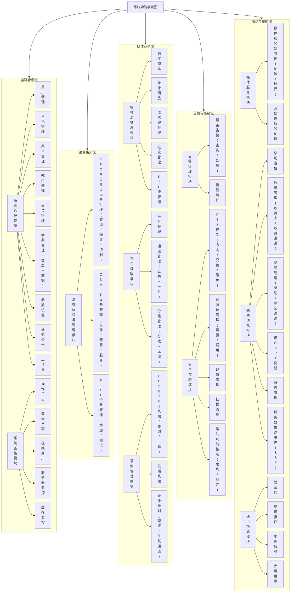
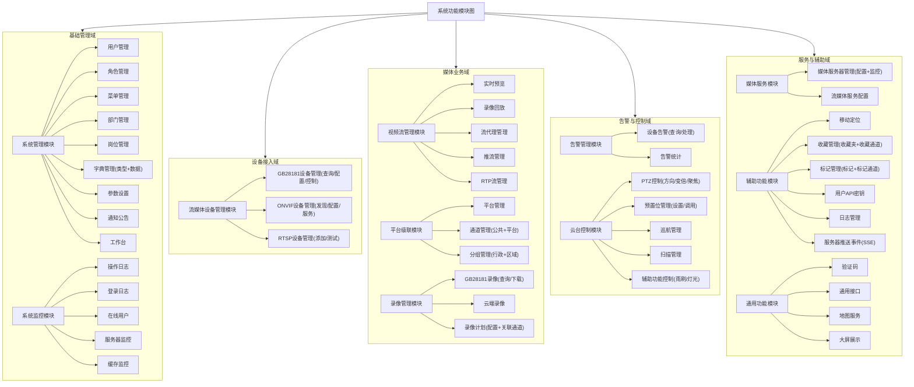

流媒体权限融合管理系统功能模块结构

## 功能模块结构

一、基础管理域

1. 系统管理模块
   1.1 用户管理
   1.2 角色管理
   1.3 菜单管理
   1.4 部门管理
   1.5 岗位管理
   1.6 字典管理（类型+数据）
   1.7 参数设置
   1.8 通知公告
   1.9 工作台
2. 系统监控模块
   2.1 操作日志
   2.2 登录日志
   2.3 在线用户
   2.4 服务器监控
   2.5 缓存监控

二、设备接入域
   3. 流媒体设备管理模块
      3.1 GB28181设备管理（查询/配置/控制）
      3.2 ONVIF设备管理（发现/配置/服务）
      3.3 RTSP设备管理（添加/测试）

三、媒体业务域
   4. 视频流管理模块
      4.1 实时预览
      4.2 录像回放
      4.3 流代理管理
      4.4 推流管理
      4.5 RTP流管理
   5. 平台级联模块
      5.1 平台管理
      5.2 通道管理（公共通道+平台通道）
      5.3 分组管理（行政分组+区域管理）
   6. 录像管理模块
      6.1 GB28181录像（查询/下载）
      6.2 云端录像
      6.3 录像计划（配置+关联通道）

四、告警与控制域
   7. 告警管理模块
      7.1 设备告警（查询/处理）
      7.2 告警统计
   8. 云台控制模块
      8.1 PTZ控制（方向/变倍/聚焦）
      8.2 预置位管理（设置/调用）
      8.3 巡航管理
      8.4 扫描管理
      8.5 辅助功能控制（雨刷/灯光）

五、服务与辅助域
   9. 媒体服务模块
      9.1 媒体服务器管理（配置+监控）
      9.2 流媒体服务配置
   10. 辅助功能模块
       10.1 移动定位
       10.2 收藏管理（收藏夹+收藏通道）
       10.3 标记管理（标记+标记通道）
       10.4 用户API密钥
       10.5 日志管理
       10.6 服务器推送事件(SSE)
   11. 通用功能模块
       11.1 验证码
       11.2 通用接口
       11.3 地图服务
       11.4 大屏展示

适用于 Excalidraw 的 Mermaid 代码：

